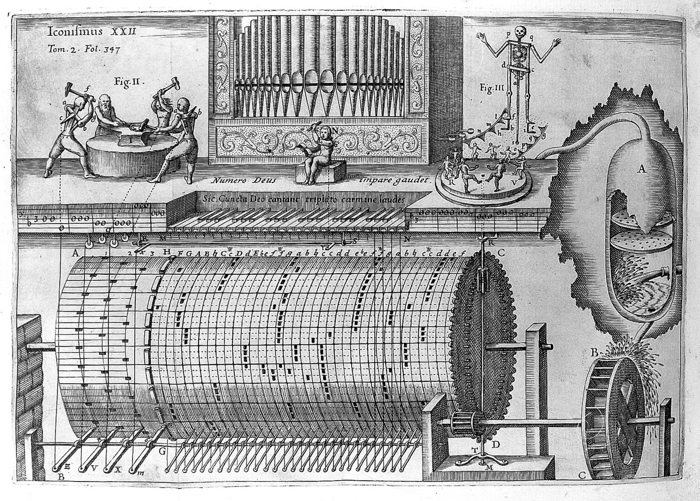

# ORGANOLOGÍA Y ACÚSTICA

|||[**Invitados**](pages/videos.md)|

En esta página se puede encontrar todos los recursos audiovisuales y de código de mi trabajo Entrelazados: el posthumanismo en la música electroacústica desarrollado en la ENES Morelia como parte de mi exámen de titulación en la licenciatura de Música y Tecnología Artística.

# [**Herramientas de partida**](pages/herramientas.md)

## Temario

### Unidad 1

1. [CONCEPTO DE ACÚSTICA EN FÍSICA Y ACÚSTICA MUSICAL Y RESEÑA HISTÓRICA.](pages/acustica.md) 
2. [¿QUÉ ES EL SONIDO? CONCEPTOS DE FRECUENCIA, AMPLITUD Y ENVOLVENTE.](pages/sonido.md) 
3. PROPAGACIÓN DEL SONIDO: REFLEXIÓN, DIFRACCIÓN Y ABSORCIÓN.
4. SONIDOS COMPLEJOS: ESPECTROS ARMÓNICOS, INARMÓNICOS Y CONTINUOS.
5. PSICOACÚSTICA: EL OÍDO Y LA PERCEPCIÓN DEL SONIDO. 
6. ACÚSTICA MUSICAL, SISTEMAS DE AFINACIÓN Y TEMPERAMENTO.
7. ÍNDICES ACÚSTICOS: CONCEPTO, NOMBRES Y REPRESENTACIÓN.

### Unidad 2
1. CLASIFICACIÓN DE INSTRUMENTOS MUSICALES: GEVAERT, HORNBOSTEL-SACHS. o IDIÓFONOS Y MEMBRANÓFONOS.
2. VIBRACIONES DE VARILLAS, PLACAS Y MEMBRANAS.
3. CORDÓFONOS Y AERÓFONOS.
4. LEYES DE MERSENNE Y FUNCIONAMIENTO DE LOS TUBOS SONOROS
5. LA VOZ HUMANA: APARATO FONADOR
6. ELECTRÓFONOS

### Unidad 3. AUDIO ANALÓGICO, DIGITAL Y NUEVAS TECNOLOGÍAS

1. CADENA ELECTROACÚSTICA
2. TRANSMISIÓN, GRABACIÓN Y REPRODUCCIÓN DE AUDIO ANALÓGICO o AUDIO DIGITAL
3. REPRESENTACIÓN SIMBÓLICA (MIDI)
4. MÚSICA CONCRETA, ELECTRÓNICA Y ELECTROACÚSTICA
5. NUEVAS INTERFACES DE EXPRESIÓN MUSICAL